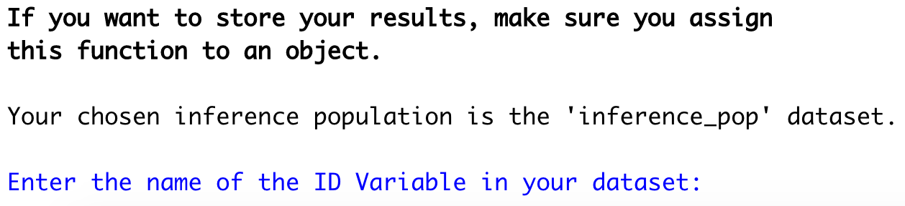
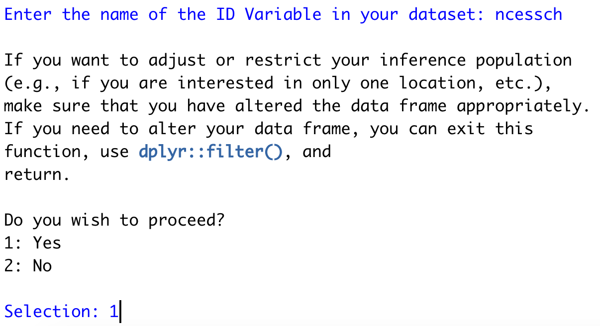
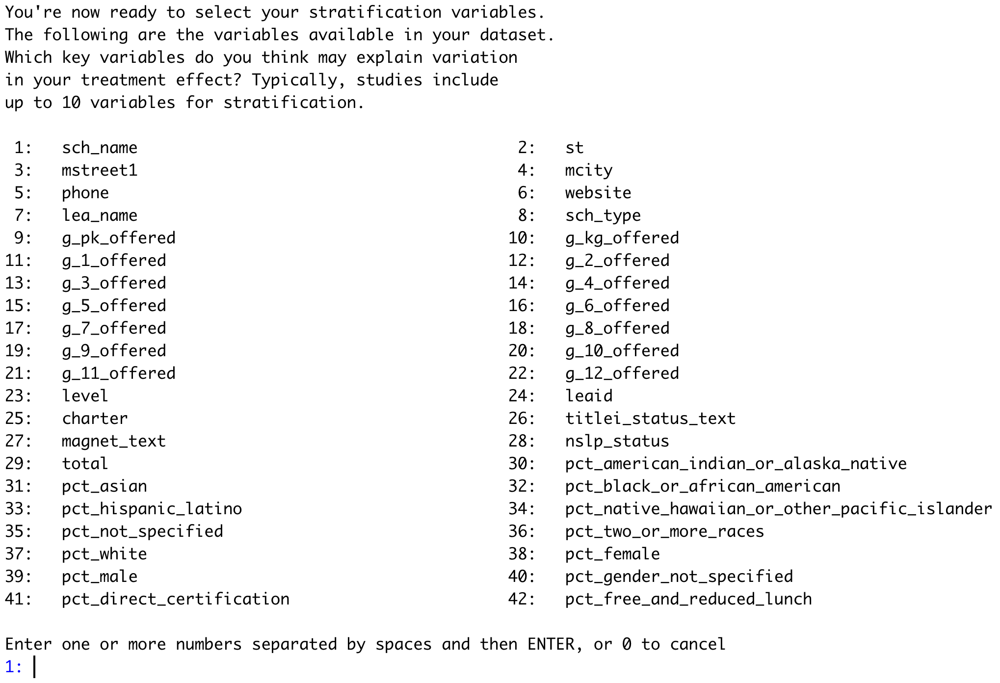

```{r setup, include=FALSE}
knitr::opts_chunk$set(echo = TRUE)
library(crayon)
```

## Introduction

Note that it is possible to use the package at either end of the sampling process; that is, you can start at the beginning and use the package to obtain a stratified sample, or you can start at the end with your previously-obtained sample data and assess its generalizability.

### Setup

```{r}
# install.packages('devtools')
# install_github('katiecoburn/generalizeRdata')
# install_github('katiecoburn/generalizeR')
library(devtools)
library(tidyverse)
library(generalizeRdata)
library(generalizeR)
```

Soon the generalizeR package will be on CRAN and can be installed with 'install.packages'. The supplemental package, generalizeRdata, however, will always be on GitHub since the data files it contains are quite large and incapable of meeting CRAN's size constraints.

## Step 1: Stratify

The stratify() function defaults to 'guided' mode, meaning that it prints text throughout and prompts the user to enter information with a question-and-answer format. This is intentional, in part to mimic the nature of http://thegeneralizer.org/ and in part because we intend for this R package to be as accessible as possible for people with limited R experience.

Users who are running stratify() multiple times, who are familiar with R, or who simply dislike the guided feature can turn it off by using the argument 'guided = FALSE'. If they do so, however, they must be sure to specify values for all the other function arguments, as those would otherwise be obtained from user input later.

This tutorial will follow two hypothetical examples. 

The first is of an education researcher who wants to test the . The researcher has somewhat limited resources, so they plan on a sample size of 40 schools. They want to estimate the average effect of their intervention in Texas charter schools. Thus, their **inference population** consists of *all Texas charter high schools*. Previous literature suggests that gender, minority status, and social class might affect gaps in achievement, so the researcher selects a few **stratifying variables** -- *percentage female, percentage black, and percentage free and reduced lunch*. The researcher also thinks school size might result in treatment differences, so they include the *total school size* as well.

Since this researcher is working with high schools, they can use the Common Core database we provide in 'generalizeRdata'. For information on each of the columns and the source of the data, run '?cc'.

```{r}
cc
```

By looking at the 'st' column, we can already see a problem here. The data frame contains schools from all states in the US, but the researcher has a much narrower inference population. Therefore, there is some filtering they must do first.

To identify Texas schools, the researcher can select those rows with 'st' equal to 'TX':

```{r}
inference_pop <- cc %>% 
  filter(st == "TX")
```

There is a variable in the data frame called 'charter'; '?cc' will show that it takes on the value of 0 for non-charter schools and 1 for charter schools. Finally, to select high schools (which almost always include grades 9 to 12), the researcher can use one of the grade indicator variables, say 'g_10_offered'. After combining all of these filters, we get:

```{r}
inference_pop <- cc %>% 
  filter(st == "TX") %>% 
  filter(charter == 1) %>% 
  filter(g_10_offered == "Yes")

print(inference_pop)
```

The size of our inference population has dropped from over 98,000 schools to about 350 schools. It now only includes Texas charter high schools (or schools that offer 10th grade).

The researcher can then run:

```{r eval=FALSE}
stratify(data = inference_pop)
```

They are greeted with the following:



```{r include=FALSE, eval=FALSE}
cat(bold("If you want to store your results, make sure you assign \nthis function to an object.\n\n"))

cat("Your chosen inference population is the '", deparse(substitute(inference_pop)), "' dataset.", sep = "")
cat("\n")
cat("\n")

idnum <- readline(prompt = "Enter the name of the ID Variable in your dataset: ")
```

At the prompt, they enter the column name that contains the NCES school IDs in the CCD database -- "ncessch":



```{r include=FALSE, echo=FALSE}
cat("If you want to adjust or restrict your inference population \n(e.g., if you are interested in only one location, etc.), \nmake sure that you have altered the data frame appropriately. \nIf you need to alter your data frame, you can exit this \nfunction, use dplyr::filter(), and \nreturn.\n")
```

The researcher has already done this, so they press on.

```{r include=FALSE}
idnum <- "ncessch"
data <- inference_pop
id <- data %>% select(all_of(idnum))
data <- data %>% select(-all_of(idnum))
```

```{r echo=FALSE, include=FALSE}
cat("\nYou're now ready to select your stratification variables. \nThe following are the variables available in your dataset.")
```



The second example is someone who wants all locations for a survey and includes at least one categorical stratifying variable. Big sample size.

## Step 2: Recruit

## Step 3: Assess
