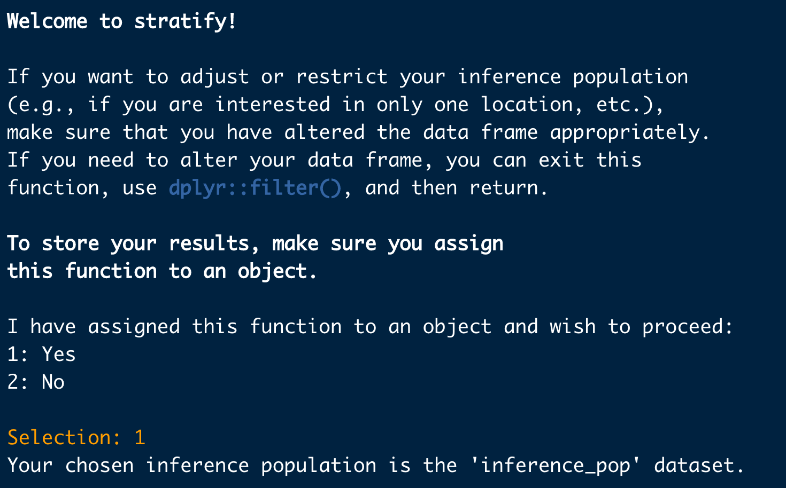
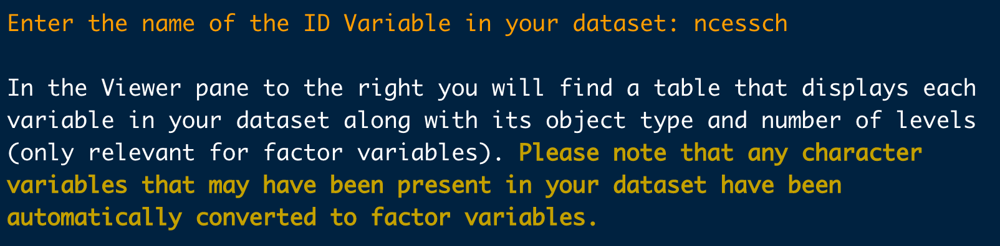
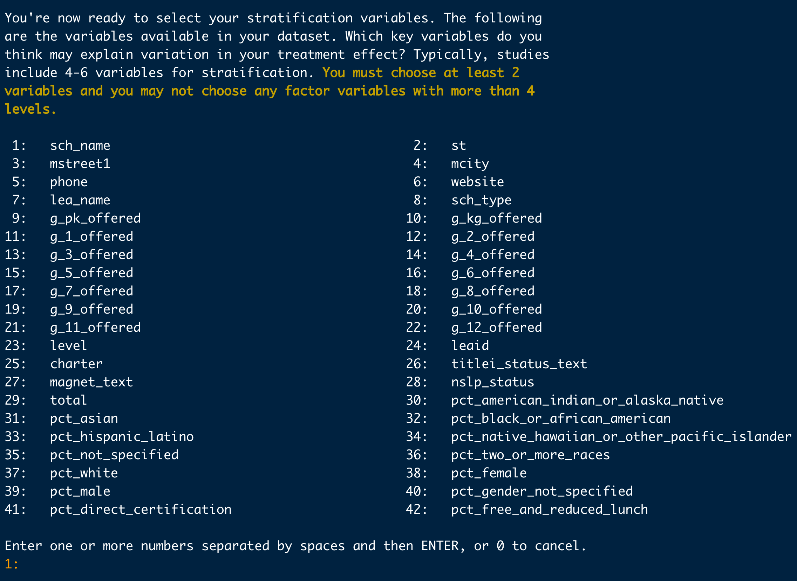
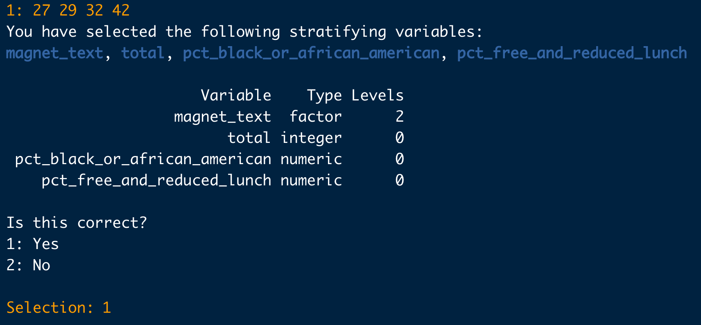
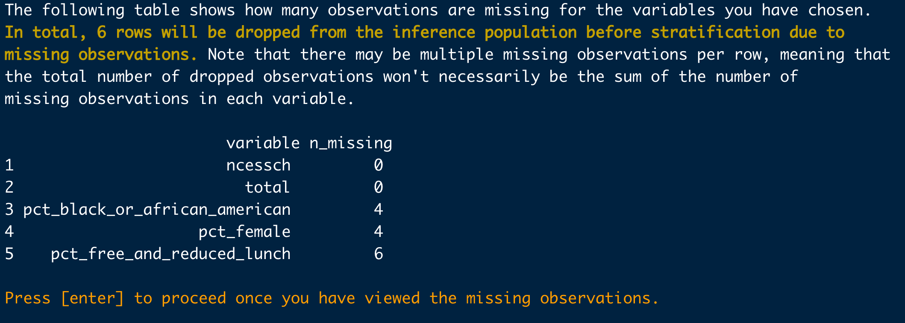
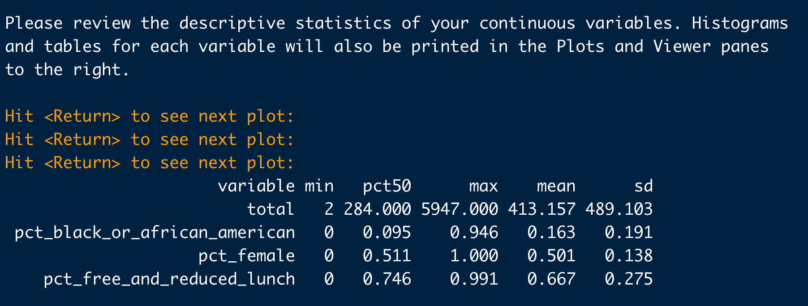

```{r setup, include=FALSE}
knitr::opts_chunk$set(echo = TRUE)
library(crayon)
```

## Introduction

Note that it is possible to use the package at either end of the sampling process; that is, you can start at the beginning and use the package to obtain a stratified sample, or you can start at the end with your previously-obtained sample data and assess its generalizability.

### Setup

```{r}
# install.packages('devtools')
# install_github('katiecoburn/generalizeRdata')
# install_github('katiecoburn/generalizeR')
library(devtools)
library(tidyverse)
library(generalizeRdata)
library(generalizeR)
library(ggthemes)
library(gridExtra)
```

Soon the generalizeR package will be on CRAN and can be installed with 'install.packages'. The supplemental package, generalizeRdata, however, will always be on GitHub since the data files it contains are quite large and incapable of meeting CRAN's size constraints.

## Step 1: Stratify

The stratify() function defaults to 'guided' mode, meaning that it prints text throughout and prompts the user to enter information with a question-and-answer format. This is intentional, in part to mimic the nature of http://thegeneralizer.org/ and in part because we intend for this R package to be as accessible as possible for people with limited R experience.

Users who are running stratify() multiple times, who are familiar with R, or who simply dislike the guided feature can turn it off by using the argument 'guided = FALSE'. If they do so, however, they must be sure to specify values for all the other function arguments, as those would otherwise be obtained from user input later.

This tutorial will follow two hypothetical examples. 

### Example One

The first is of an education researcher who wants to test the . The researcher has somewhat limited resources, so they plan on a sample size of 40 schools. They want to estimate the average effect of their intervention in Texas charter high schools. Thus, their **inference population** consists of *all Texas charter high schools*. Previous literature suggests that gender, minority status, and social class might affect gaps in achievement, so the researcher selects a few **stratifying variables** -- *percentage female, percentage black, and percentage free and reduced lunch*. The researcher also thinks school size might result in treatment differences, so they include the *total school size* as well.

Since this researcher is working with high schools, they can use the Common Core database we provide in 'generalizeRdata'. For information on each of the columns and the source of the data, run '?cc'.

```{r}
cc
```

By looking at the 'st' column, we can already see a problem here. The data frame contains schools from all states in the US, but the researcher has a much narrower inference population. Therefore, there is some filtering they must do first.

To identify Texas schools, the researcher can select those rows with 'st' equal to 'TX':

```{r}
inference_pop <- cc %>% 
  filter(st == "TX")
```

There is a variable in the data frame called 'charter'; '?cc' will show that it takes on the value of 0 for non-charter schools and 1 for charter schools. Finally, to select high schools (which almost always include grades 9 to 12), the researcher can use one of the grade indicator variables, say 'g_10_offered'. After combining all of these filters, we get:

```{r}
inference_pop <- cc %>% 
  filter(st == "TX") %>% 
  filter(charter == 1) %>% 
  filter(g_10_offered == "Yes")

inference_pop
```

The size of our inference population has dropped from over 98,000 schools to about 350 schools. It now only includes Texas charter high schools (or schools that offer 10th grade).

The researcher can then run:

```{r eval=FALSE}
output <- stratify(data = inference_pop)
```

They are greeted with the following:



```{r include=FALSE, eval=FALSE}
cat(bold("If you want to store your results, make sure you assign \nthis function to an object.\n\n"))

cat("Your chosen inference population is the '", deparse(substitute(inference_pop)), "' dataset.", sep = "")
cat("\n")
cat("\n")

idnum <- readline(prompt = "Enter the name of the ID Variable in your dataset: ")
```

At the prompt, they enter the column name that contains the NCES school IDs in the CCD database -- "ncessch":



```{r include=FALSE, echo=FALSE}
cat("If you want to adjust or restrict your inference population \n(e.g., if you are interested in only one location, etc.), \nmake sure that you have altered the data frame appropriately. \nIf you need to alter your data frame, you can exit this \nfunction, use dplyr::filter(), and \nreturn.\n")
```

The researcher has already done this, so they select 'yes'.

```{r include=FALSE}
idnum <- "ncessch"
data <- inference_pop
id <- data %>% select(all_of(idnum))
data <- data %>% select(-all_of(idnum))
```

```{r echo=FALSE, include=FALSE}
cat("\nYou're now ready to select your stratification variables. \nThe following are the variables available in your dataset.")
```



The researcher now selects the variables that represent their stratifying variables of interest -- 'pct_female', 'pct_black_or_african_american', 'pct_free_and_reduced_lunch', and 'total'. They enter: '29 32 38 42'.



The function prints out a list of the variables chosen with names highlighted and a table of variables and their types. This is so the researcher can look them over, confirm what they selected, and make sure the variables are the expected types. Since these results seem reasonable, the researcher chooses 'Yes'.



Next, the function prints out the descriptive statistics of the stratification variables chosen, categorical and continuous. In this case, all the variables are continuous. Plots of the variables -- histograms or bar charts, as appropriate -- are generated and displayed one at a time.

```{r, fig.height = 3, fig.width = 7.5, echo=FALSE, warning=FALSE}
par(mar = c(4, 4, .1, .1))
plot1 <- inference_pop %>% 
  ggplot(aes(x = total)) + geom_histogram(bins = 30) +
  theme_base() + 
  xlab("total") +
  labs(title = "Histogram of total")

plot2 <- inference_pop %>% 
  ggplot(aes(x = pct_black_or_african_american)) + geom_histogram(bins = 30) +
  theme_base() + 
  xlab("pct_black") +
  labs(title = "Histogram of pct_black")

grid.arrange(plot1, plot2, ncol = 2)
```

```{r, fig.height = 3, fig.width = 7.5, echo=FALSE, warning=FALSE}
par(mar = c(4, 4, .1, .1))
plot1 <- inference_pop %>% 
  ggplot(aes(x = pct_female)) + geom_histogram(bins = 30) +
  theme_base() + 
  xlab("pct_female") +
  labs(title = "Histogram of pct_female")

plot2 <- inference_pop %>% 
  ggplot(aes(x = pct_free_and_reduced_lunch)) + geom_histogram(bins = 30) +
  theme_base() + 
  xlab("pct_frlunch") +
  labs(title = "Histogram of pct_frlunch")

grid.arrange(plot1, plot2, ncol = 2)
```

Now the researcher is ready to choose a number of strata. The function prints some information, similar to that presented by the Generalizer Web application, explaining what the choice represents and giving users some guidance. While choosing more strata is generally better, the practical demand placed on the sampling process increases with the number of strata, because units must be sampled from each stratum.

Since the researcher in our example plans on a sample size of 40, they try a smaller number -- 4 strata:



The process of stratifying can take some time. If the function were to run silently, users might fear that R had frozen and quit. As a sort of progress bar, we have turned on "verbose" mode for the clustering process, which prints out the within-cluster sum of squares at each iteration until the stratifying process converges:


The results begin by telling the user the percentage of population variation explained by the strata -- in this case, about 66%. Increasing the number of strata would increase the percentage explained and result in more homogeneous strata, but would require more resources.

The function also provides a table of the within-cluster means and standard deviations for each of the stratifying variables, and a count of the total number of units in each stratum.


```{r, echo=FALSE, include=FALSE}
test <- (stratify(inference_pop, guided = FALSE, n_strata = 4, variables = c("total", "pct_black_or_african_american", "pct_female", "pct_free_and_reduced_lunch")))
```

It prints a heat map:

```{r, fig.height = 5, fig.width = 7.5, echo=FALSE}
test$heat_plot_final
```

Each column of the heat map corresponds to a stratum. Users can read the map by going down the columns, assessing each stratum in relation to the population. Since the goal is for the strata to be homogeneous, to sample across them and gain a sample representative of the population, each stratum will differ from the others. We'll "read" a stratum here as an example:

The first stratum contains 161 Texas charter high schools which are close to the population mean in number of students (about 430), above the population mean in the percentage of students on free or reduced lunch (80%), close to the population mean in percentage of female students (50%), and below the population mean in percentage of black students (10%).

(Users may wonder why the shade of red for the bottom left and bottom right cells differs when both seem to have a mean of 10%. This is because of the scale of the variable, the size of the population mean, and rounding.)

Finally, users are given the option to change the number of strata. The researcher says 'no'; they are satisfied with four.


They have completed the stratifying process! For their study, the next step is figuring out which units from these strata to recruit. They can proceed to the second function, 'recruit().'

### Example Two

The second example is someone who wants higher education institutions in multiple locations for a survey and includes at least one categorical stratifying variable. Big sample size -- 500. 

```{r}
ipeds
```

```{r}
inference_pop <- ipeds %>% 
  filter(state == "CA" | state == "FL" | state == "NY")

inference_pop
```

```{r, eval=FALSE}
output <- stratify(inference_pop, guided = FALSE, n_strata = 8, 
                   variables = c("pct_female", "pct_pell"), 
                   idnum = "unitid")
```


## Step 2: Recruit

In each of these examples, our researchers have successfully stratified their inference populations into 4 and 8 clusters, respectively. Their goal is now to sample units from each cluster in such a way that their overall sample will be representative of their entire inference population. The 'recruit()' function is their next step.

Like the 'stratify()' function, 'recruit()' is guided by default; users can simply set 'guided = FALSE' to turn this option off if they choose, but (again) they must specify values for the other function arguments instead.

Since the results of 'stratify()' were saved to an object, that object can be read into 'recruit()', which automatically learns information about the stratification process:

```{r eval=FALSE}
recruit(output)
```


## Step 3: Assess
