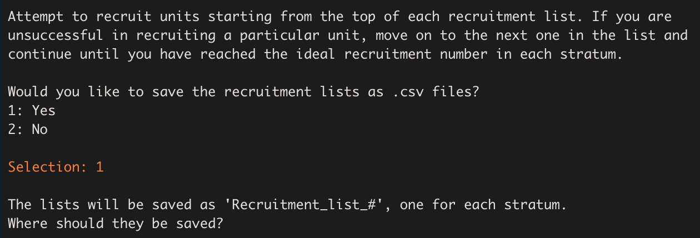

```{r setup, include=FALSE}
# Note:
#  changing back to this (below)
#   rmarkdown::html_vignette
# would probably make the vignette smaller.
knitr::opts_chunk$set(echo = TRUE)
library(crayon)
# install.packages('devtools')
library(devtools)
library(tidyverse)
# install_github("katiecoburn/generalizeRdata")
# install_github("NUstat/generalizeR")
library(generalizeRdata)
library(generalizeR)
library(ggthemes)
# install_github("eliocamp/ggnewscale")
library(ggnewscale)
library(gridExtra)
library(ggrepel)
# install.packages("usmap")
library(usmap)
# install.packages("kableExtra")
library(kableExtra)
# install.packages("viridis")
library(viridis)
# install.packages("patchwork")
library(patchwork)
library(lazyeval)
```

## Introduction

Welcome to the generalizeR! This package is designed to guide education researchers through:

- Using important features of their inference population to stratify units 
- Developing a recruitment plan for a future evaluation
- Assessing the generalizability of a completed evaluation

Note that it is possible to use the package at either end of the sampling process: you can start at the beginning and use the package to obtain a stratified sample, or you can start at the end with your previously obtained sample data and assess its generalizability.

## Step 1: Stratify

The `stratify()` function defaults to 'guided' mode, meaning that it prints text throughout and prompts the user to enter information with a question-and-answer format. This is intentional, in part to mimic the nature of http://thegeneralizer.org/ and in part because we intend for this R package to be as accessible as possible for people with limited R experience.

Users who are running `stratify()` multiple times, who are familiar with R, or who simply dislike the guided feature can turn it off by using the argument 'guided = FALSE'. If they do so, however, they must be sure to specify values for all the other function arguments, as those would otherwise be obtained from user input later.

This tutorial will follow a hypothetical example.

### Filtering the Inference Population

Suppose we are a team of education researchers who want to test the effect of an intervention on SAT scores. We have somewhat limited resources, so we plan on using a sample size of 40 schools. We want to estimate the average effect of our intervention in Texas charter high schools. Thus, our **inference population** consists of *all Texas charter high schools*. Previous literature suggests that gender, minority status, and social class might affect gaps in achievement, so we select a few **stratifying variables** -- *percentage female*, *percentage black*, and *percentage free and reduced lunch*. We also think school size might result in treatment differences, so we include the *total school size* as well.

Since we are working with high schools, we can use the Common Core database provided in 'generalizeRdata'. For information on each of the columns and the source of the data, run `?cc`.

```{r}
cc
```

By looking at the `st` column, we can already see a problem here. The data frame contains schools from all states in the US, but we are interested in a much narrower inference population. Therefore, there is some filtering we must do first.

To identify Texas schools, we can select those rows with `st` equal to `TX`:

```{r}
inference_pop <- cc %>% 
  filter(st == "TX")
```

To filter out the non-charter schools, we can use the variable in our data frame called `charter` that takes on the value of 0 for non-charter schools and 1 for charter schools. Finally, to select high schools (which almost always include grades 9 to 12), we can use one of the grade indicator variables, say `g_10_offered`. After combining all of these filters, we get:

```{r}
inference_pop <- cc %>% 
  filter(st == "TX") %>% 
  filter(charter == 1) %>% 
  filter(g_10_offered == "Yes")
inference_pop
```

The size of our inference population has dropped from over 98,000 schools to about 350 schools. It now only includes Texas charter high schools (or schools that offer 10th grade).

### Running the Function 

We are now ready to run `stratify()` on our inference population. We enter:

```{r eval=FALSE}
output <- stratify(data = inference_pop)
```

We are greeted with the following:


### Selecting the ID Variable

The above prompt requires us to enter the name of the ID variable we wish to use. We enter the name of the column that contains the unique NCES school IDs in the CCD database -- `ncessch`. 


We then receive a message informing us that `stratify()` has converted all the character variables in our data frame to factor variables. This means some factor variables will have a large number of levels if their original character versions had many distinct observations. We are also told a table displaying an overview of the variables in our data frame has been printed in the Viewer pane. A preview of that same table is shown below. In general, whenever a table is printed to the console, there will be one printed in the Viewer pane as well.

```{r include=FALSE}
inference_pop <- inference_pop %>%
    mutate(across(where(is_character) & !ncessch, as_factor))
```

```{r echo=FALSE}
vars <- inference_pop %>% names()
type <- inference_pop %>% sapply(class)
num_levels <- inference_pop %>% sapply(nlevels)

var_overview <- cbind(vars, type, num_levels) %>% data.frame() %>% arrange(type)
rownames(var_overview) <- NULL
colnames(var_overview) <- c("Variable", "Type", "Levels")

var_overview %>% 
  head(n = 5) %>% 
  kbl(caption = "Variable Overview",
      align = "l") %>%
  footnote(general = "Only the first 5 rows of the table are shown.") %>% 
  kable_styling(c("striped", "hover", "condensed"))
```

### Selecting the Stratification Variables

Next we receive a prompt asking us to select our stratification variables and a menu showing us all the variables available in our dataset. We are also given a warning that we must select at least two variables and we can't choose any factor variable containing more than 4 levels. These restrictions are put in place to prevent errors and ensure the stratification process goes smoothly. If we wish to use a factor variable with more than 4 levels for stratification, we must first exit `stratify()` and re-code our desired factor levels from that variable as indicator variables within our data frame (the package `fastDummies` may be of use).


For our stratifying variables of interest, we have chosen `pct_female`, `pct_black_or_african_american`, `pct_free_and_reduced_lunch`, and `total`. We enter: `29 32 38 42`. The function prints out a list of these variables with their names highlighted in blue, as well as a table displaying each variable's type and number of levels. This is done so we can look them over, confirm what we selected, and make sure the variables are the types we expected. Since these results seem reasonable, we indicate that they are correct by entering `1`.



### Missing Observations

We are now shown a table (also available in the Viewer pane) that breaks down how many missing observations each variable contains, including our id variable `ncessch`. These observations will be dropped from the inference population before the stratification is performed.


### Descriptive Statistics

Next, the function prints out the descriptive statistics of the stratification variables chosen, both categorical and continuous. In this case, all the variables are continuous. Plots of the variables -- histograms or bar charts, as appropriate -- are generated and displayed one at a time.


```{r include=FALSE}
fill_colors <- viridis(4, alpha = 0.7, direction = sample(c(-1, 1), size = 1)) %>% sample()
outline_colors <- turbo(4) %>% sample()
```

```{r include=FALSE}
p1 <- inference_pop %>% ggplot(aes(x = pct_female)) +
              geom_histogram(bins = 30,
                             fill = fill_colors[1],
                             color = outline_colors[1]) +
              theme_minimal() +
              theme(plot.title = element_text(size = 6),
                    axis.title = element_text(size = 5),
                    axis.text = element_text(size = 5),
                    axis.ticks.length = unit(0, "pt")) +
              xlab("pct_female") +
              labs(title = "Histogram of pct_female")
```

```{r include=FALSE}
p2 <- inference_pop %>% ggplot(aes(x = pct_black_or_african_american)) +
              geom_histogram(bins = 30,
                             fill = fill_colors[2],
                             color = outline_colors[2]) +
              theme_minimal() +
              theme(plot.title = element_text(size = 6),
                    axis.title = element_text(size = 5),
                    axis.text = element_text(size = 5),
                    axis.ticks.length = unit(0, "pt")) +
              xlab("pct_black_or_african_american") +
              labs(title = "Histogram of \npct_black_or_african_american")
```

```{r include=FALSE}
p3 <- inference_pop %>% ggplot(aes(x = pct_free_and_reduced_lunch)) +
              geom_histogram(bins = 30,
                             fill = fill_colors[3],
                             color = outline_colors[3]) +
              theme_minimal() +
              theme(plot.title = element_text(size = 6),
                    axis.title = element_text(size = 5),
                    axis.text = element_text(size = 5),
                    axis.ticks.length = unit(0, "pt")) +
              xlab("pct_free_and_reduced_lunch") +
              labs(title = "Histogram of \npct_free_and_reduced_lunch")
```

```{r include=FALSE}
p4 <- inference_pop %>% ggplot(aes(x = total)) +
              geom_histogram(bins = 30,
                             fill = fill_colors[4],
                             color = outline_colors[4]) +
              theme_minimal() +
              theme(plot.title = element_text(size = 6),
                    axis.title = element_text(size = 5),
                    axis.text = element_text(size = 5),
                    axis.ticks.length = unit(0, "pt")) +
              xlab("total") +
              labs(title = "Histogram of total")
```

```{r echo=FALSE, message=FALSE, warning=FALSE, dpi = 200}
p1 + p2 + p3 + p4
```

### Choosing the Number of Strata

Now we are ready to choose the number of strata in which to divide our population. `stratify()` prints some information, similar to that presented by the [Generalizer Web application](https://www.thegeneralizer.org/), explaining what the choice represents and giving us some guidance. While choosing more strata is generally better, the practical demand placed on the sampling process increases with the number of strata, because units must be sampled from each stratum.

Since we are only planning on using a sample size of 40 schools, we'll try a smaller number -- 4 strata:


The process of stratifying can take some time. If the function were to run silently, users might fear that R had frozen and quit. As a sort of progress bar, we have turned on "verbose" mode for the clustering process, which prints out the within-cluster sum of squares at each iteration until the stratifying process converges:


### Understanding the Results

#### Stratification Review 
The results begin with a brief review of the stratification process. We are informed of the stratification variables, the observations dropped due to missing data, the population size (after missing observations have been dropped), the number of strata, and the proportion of variation in the population explained by the strata. In this case, that proportion was about 66%. Increasing the number of strata would increase the percentage explained and result in more homogeneous strata but would also require more resources.


#### Covariate Statistics

`stratify()` then provides us with a table of the within-stratum means and standard deviations for each of the stratifying variables, as well as a count of the total number of units in each stratum.


A similar table is printed in the Viewer pane:

```{r include=FALSE}
strat_output <- stratify(inference_pop, guided = FALSE, n_strata = 4, variables = c("total", "pct_black_or_african_american", "pct_female", "pct_free_and_reduced_lunch"), idvar = "ncessch")
```

```{r echo = FALSE}
strat_output$heat_data_kable
```

#### Heat Map

The function also prints a heat map:

```{r echo=FALSE, fig.height=6, fig.width=8}
strat_output$heat_plot
```


Each column of the heat map corresponds to a stratum. We can read the map by going down the columns, assessing each stratum in relation to the population. Remember that the goal is to sample independently within each stratum in order to obtain a sample that is representative of the population as a whole. To that end, each stratum has been made as homogeneous as possible within itself (i.e. the within-stratum variances have been minimized) while also maintaining as much heterogeneity as possible across strata (i.e. the between-stratum variance has been maximized).

Looking at the first column, we see that Stratum 1 contains 161 Texas charter high schools. These schools are: 

- close to the population mean in number of students (about 430), 
- above the population mean in the percentage of students on free or reduced lunch (80%), 
- close to the population mean in percentage of female students (50%), 
- and below the population mean in percentage of black students (10%).

The other columns may be interpreted in exactly the same manner. 

(Users may wonder why the shade of red for the bottom left and bottom right cells differs when both seem to have a mean of 10%. This is because of the scale of the variable, the size of the population mean, and rounding.)

#### Summary and Print

If we wish to look at the results of `stratify()` again, we can run the following code: 

```{r eval=FALSE}
summary(strat_output)
```

Note that `output` is the name we have assigned to our `stratify_object` in this example; users should replace it with their own name they have chosen. 

There is also an option to print our `stratify_object`. Doing so yields:


We have finished the stratifying process! 

## Step 2: Recruit

Now that we have separated our inference population into 4 strata, our next goal is to sample units from each stratum in such a way that the overall sample will be representative of the entire population. We can accomplish this task using the `recruit()` function.

Like `stratify()`, `recruit()` is guided by default; we can simply set `guided = FALSE` to turn this option off if we choose, but we must specify values for the other function arguments instead.

Since we assigned the results of `stratify()` to an object, that object can then be passed directly into `recruit()`, like so:

```{r eval = FALSE}
rec_output <- recruit(strat_output)
```

```{r include = FALSE}
#rec_output <- recruit(strat_output, guided = FALSE, sample_size = 40)
```

We are immediately greeted with the following message:


Our desired sample size is 40 schools, so we enter '40' for the number of units we wish to recruit. The function then generates a recruitment list for each stratum. It also displays a sample of one of the recruitment lists so we immediately know what they look like. Each row in a stratum's recruitment list corresponds to a different unit in the stratum, and the units have been ranked in ascending order of their [Mahalanobis distances](https://en.wikipedia.org/wiki/Mahalanobis_distance) from the mean vector of the stratifying variables. The idea is that the units with the smallest Mahalanobis distances are most likely to be "representative" of the population and so should be chosen first to be part of the sample.


Next, the function prints a recruitment table that tells us how many units we should recruit from each stratum. It arrives at these numbers by multiplying the sampling proportion (which is equal to the ratio of the stratum size to the total population size) for each stratum by the desired sample size, in this case 40.


Here is what the recruitment table looks like in the Viewer pane:
```{r echo = FALSE}
#rec_output$recruitment_kable
```

This means that our recruitment plan should be to recruit 20 schools from Stratum 1, 4 from Stratum 2, 5 from Stratum 3, and 11 from Stratum 4.

The function then asks us if we want to save the recruitment lists as csv files. 


Upon entering '1' to indicate 'Yes', a folder selection widget will appear that will allow us to choose a location on our computer in which to save the lists. Note that this only occurs when using the guided version of the function; in the non-guided version, the lists are automatically saved to our working directory if we set `save_as_csv = TRUE`.


Lastly, the function reminds us that the recruitment lists can also be accessed from its output, provided that it has been stored in an object.

We have finished the recruitment process!

## Step 3: Assess

### assess()

We are now ready to take the results we obtained from `stratify()` and `recruit()` and use them to `assess()` the generalizability of our sample data to the population.

The generalizer index is a global measure of similarity between the sample and population for a defined set of covariates (between 0 and 1). Can multiply by 100: 0.8 -> 80% similar.


### assess_wrap()

We have taken our four recruitment lists and successfully recruited the desired number of units from each stratum: 20, 4, 5, and 11 units from strata 1, 2, 3, and 4, respectively. We have completed their study and are now interested in whether our results are generalizable to other states in the US.

Recall that our inference population consisted of Texas charter high schools. Therefore, it is reasonable to wonder whether our sample can generalize to other charter high schools in the US.

First we must specify the variables that we hope are generalizable. These are the same variables we first used to stratify the population.

```{r}
selection_vars <- c("pct_female", "pct_black_or_african_american", "pct_free_and_reduced_lunch", "total")
```

Then we must read in our sample. There are multiple ways to accomplish this, but the important thing is to create a data frame consisting only of the units we have recruited from the population with a column containing the sample IDs. In this example, we will build the data frame from the four recruitment lists we generated earlier.

```{r, echo=FALSE, include=FALSE}
output <- test
```

```{r eval=FALSE}
sample <- tibble(ncessch = c(recruit_output$recruitment_lists[[1]]$ncessch[1:20],
                recruit_output$recruitment_lists[[2]]$ncessch[1:4],
                recruit_output$recruitment_lists[[3]]$ncessch[1:5],
                recruit_output$recruitment_lists[[4]]$ncessch[1:11]))
```

They specify their inference population again -- this time a data frame including all states with and without charter high schools. The data frame should include unit IDs, variables of interest, and (if applicable) a grouping variable; since the researcher wants to generalize to US states, the grouping variable is 'st' (state).

```{r}
inference_pop <- cc %>% 
  filter(charter == 1) %>%
  filter(g_10_offered == "Yes") %>%
  select(ncessch, all_of(selection_vars), st)
```

Finally, they feed their sample and populatiuon data frames, the name of the ID variable, and the name of the grouping variable to 'assess_wrap()' -- a wrapper of the included 'assess()' function for ease of use.

```{r eval=FALSE, include=FALSE}
gen_results <- assess_wrap(sample = sample, population = inference_pop,
            join_var = "ncessch", grouping_var = "st")
```
  
They can view a table of their results across states. This code extracts the 'st' variable as a factor and retains unique values, one row per state:

```{r eval=FALSE, include=FALSE}
state <- inference_pop %>% 
  na.omit() %>% 
  select(st) %>% 
  transmute(state = factor(st)) %>% 
  unique()
g_indexes <- gen_results[[2]]
```

Then that information is bound together with the generalizability indexes:

```{r eval=FALSE, include=FALSE}
g_overview <- tibble(state, g_index = g_indexes)
g_overview
```

However, the information is easier to assess in the form of a map. There are many mapping tools in R. First, we use the tidyverse to turn the generalizability index values into a categorical variable representing the three levels of generalizability.

```{r eval=FALSE, include=FALSE}
g_overview <- g_overview %>% mutate(g_index = case_when(
  g_index >= 0.90 ~ "Very High Generalizability",
  (g_index < 0.90 & g_index >= 0.70) ~ "High Generalizability",
  (g_index < 0.70 & g_index >= 0.50) ~ "Medium Generalizability",
  g_index < 0.50 ~ "Ungeneralizable",
  is.na(g_index) ~ "NA"
) %>% 
  factor(levels = c("Very High Generalizability", "High Generalizability", "Medium Generalizability", "Ungeneralizable", "NA")))
```

A G-index above 0.90 means that the sample is equivalent to a randomized trial. A G-index between 0.50 and 0.90 means that the sample is not quite a miniature of the population, but statistical adjustments to reweight the sample may make generalization possible. Finally, a G-index below 0.50 means that generalization (based upon the selected covariates) is completely unwarranted, and statistical adjustment cannot help.

```{r eval=FALSE, fig.height=5, fig.width=7.5, message=FALSE, warning=FALSE, include=FALSE}
plot_usmap(data = g_overview, values = "g_index", labels = TRUE) +
   labs(title = "US States",
       subtitle = "Generalizability Index") +
  theme(panel.background = element_rect(color = "black"), 
        legend.position = "right") + 
  scale_fill_viridis(discrete = TRUE)
```

This map tells the researcher a few things. 

Their results are equivalent to a randomized controlled trial for generalizations to charter high schools in California and Texas. Texas is to be expected here, since their entire sample came from Texas. California most likely has a charter high school population that is very similar to Texas in terms of the stratifying variables (pct_female, pct_black_or_african_american, pct_free_and_reduced_lunch, and total number of students). 

With statistical adjustments, they could make generalizations to the populations of charter high schools in: Washington, Nevada, Utah, Arizona, Colorado, Kansas, Oklahoma, Minnesota, Indiana, Wisconsin, Michigan, Ohio, Pennsylvania, New York, Connecticut, North and South Carolina, Georgia, Florida, and Arkansas. 

Generalizations to the remaining states would be completely unwarranted; in some cases this is because there are no charter high schools in the state (labeled 'NA').

This researcher had a sample size of only 40, but based on careful, stratified sampling (and with some adjustment), they should be able to generalize their intervention results to the populations of 22 US states.

<!-- ### Example Two -->

<!-- The researcher in this example conducted a survey of higher education institutions in California, New York, and Florida. They intended to have a sample size of 500. They ended up having more resources than originally expected, so they recruited a larger sample from one of the strata; instead of 74 units from cluster 4, they recruited 200, for a total sample size of 626. -->

<!-- ```{r, include=FALSE, echo=FALSE, warning=FALSE, message=FALSE} -->
<!-- inference_pop <- ipeds %>%  -->
<!--   filter(state == "CA" | state == "FL" | state == "NY") -->
<!-- output <- stratify(inference_pop, guided = FALSE, n_strata = 6,  -->
<!--                    variables = c("control_level", "pct_female", -->
<!--                                  "remedial_services"),  -->
<!--                    idvar = "unitid") -->
<!-- ``` -->

<!-- Most of their assessment process is the same as the previous example; they specify the variables that they want to generalize on, read in their sample data, and create their inference population: -->

<!-- ```{r, warning=FALSE, message=FALSE} -->
<!-- selection_vars <- c("control_level", "remedial_services", "pct_female") -->
<!-- sample <- tibble(unitid = c(output$recruitment_lists[[1]]$unitid[1:16], -->
<!--                 output$recruitment_lists[[2]]$unitid[1:160], -->
<!--                 output$recruitment_lists[[3]]$unitid[1:74], -->
<!--                 output$recruitment_lists[[4]]$unitid[1:200], -->
<!--                 output$recruitment_lists[[5]]$unitid[1:64], -->
<!--                 output$recruitment_lists[[6]]$unitid[1:112])) -->

<!-- inference_pop <- ipeds %>%  -->
<!--   select(unitid, all_of(selection_vars), state) -->
<!-- ``` -->

<!-- They feed their sample and population to 'assess_wrap()' and prepare the generalizability indexes for mapping: -->

<!-- ```{r, warning=FALSE, message=FALSE} -->
<!-- gen_results <- assess_wrap(sample = sample, population = inference_pop, -->
<!--             join_var = "unitid", grouping_var = "state") -->

<!-- state <- inference_pop %>%  -->
<!--   na.omit() %>%  -->
<!--   select(state) %>%  -->
<!--   unique() -->
<!-- g_indexes <- gen_results[[2]] -->
<!-- g_overview <- tibble(state, g_index = g_indexes) -->
<!-- g_overview -->
<!-- g_overview <- g_overview %>% mutate(g_index = case_when( -->
<!--   g_index >= 0.90 ~ "best", -->
<!--   (g_index < 0.90 & g_index >= 0.50) ~ "okay", -->
<!--   g_index < 0.50 ~ "worst", -->
<!--   is.na(g_index) ~ "worst" -->
<!-- )) -->
<!-- ``` -->

<!-- Then they map it. -->

<!-- ```{r, fig.height = 5, fig.width = 7.5, warning=FALSE, message=FALSE} -->
<!-- plot_usmap(data = g_overview, values = "g_index", labels = TRUE) + -->
<!--    labs(title = "US States", -->
<!--        subtitle = "Generalizability Index") + -->
<!--   theme(panel.background = element_rect(color = "black"),  -->
<!--         legend.position = "right") +  -->
<!--   scale_fill_grey() -->
<!-- ``` -->


# Step 4: Weighting
