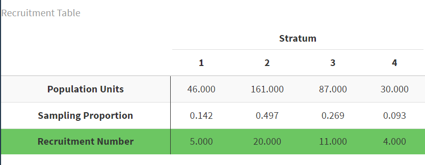
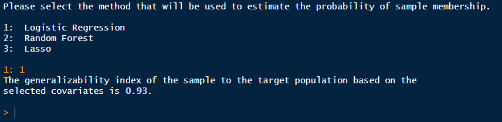
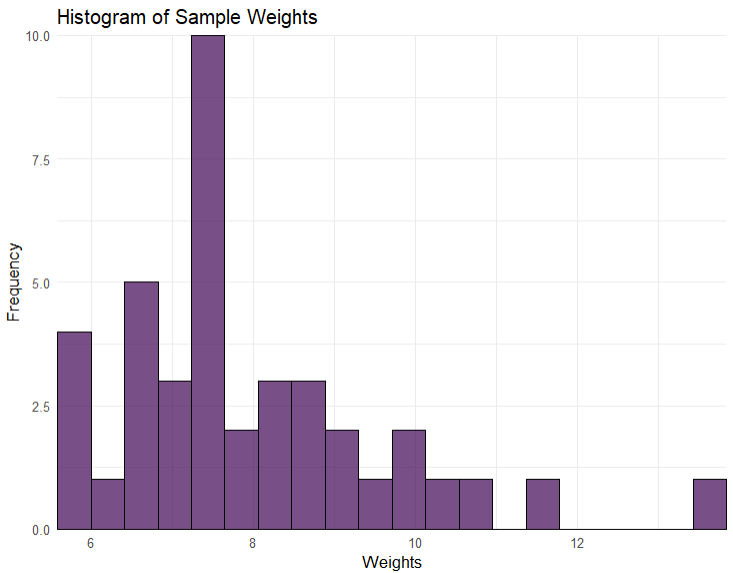

```{r setup, include=FALSE}
# Note:
#  changing back to this (below)
#   rmarkdown::html_vignette
# would probably make the vignette smaller.
knitr::opts_chunk$set(echo = TRUE)
library(crayon)
# install.packages('devtools')
library(devtools)
library(tidyverse)
library(generalizeR)
library(ggthemes)
# install_github("eliocamp/ggnewscale")
library(ggnewscale)
library(gridExtra)
library(ggrepel)
# install.packages("usmap")
library(usmap)
# install.packages("kableExtra")
library(kableExtra)
# install.packages("viridis")
library(viridis)
# install.packages("patchwork")
library(patchwork)
library(lazyeval)
devtools::load_all()
```

## Introduction

Welcome to the generalizeR! This package is designed to guide education researchers through:

-   Using important features of their inference population to stratify units
-   Developing a recruitment plan for a future evaluation
-   Assessing the generalizability of a completed evaluation

Note that it is possible to use the package at either end of the sampling process: you can start at the beginning and use the package to obtain a stratified sample, or you can start at the end with your previously obtained sample data and assess its generalizability.

## Step 1: Stratify

### Guided

The `stratify()` function defaults to 'guided' mode, meaning that it prints text throughout and prompts the user to enter information with a question-and-answer format. This is intentional, in part to mimic the nature of <https://thegeneralizer.org/> and in part because we intend for this R package to be as accessible as possible for people with limited R experience.

Users who are running `stratify()` multiple times, who are familiar with R, or who simply dislike the guided feature can turn it off by using the argument 'guided = FALSE'. If they do so, however, they must be sure to specify values for all the other function arguments, as those would otherwise be obtained from user input later.

This tutorial will follow a hypothetical example.

### Filtering the Inference Population

Suppose we are a team of education researchers who want to test the effect of an intervention on SAT scores. We have somewhat limited resources, so we plan on using a sample size of 40 schools. We want to estimate the average effect of our intervention in Texas charter high schools. Thus, our **inference population** consists of *all Texas charter high schools*. Previous literature suggests that gender, minority status, and social class might affect gaps in achievement, so we select a few **stratifying variables** -- *percentage female*, *percentage black*, and *percentage free and reduced lunch*. We also think school size might result in treatment differences, so we include the *total school size* as well.

Since we are working with high schools, we can use the Common Core database provided in the `generalizeRdata` package. For information on each of the columns and the source of the data, run `?cc`. Since the `cc` dataset is in a separate package, we will be using a small subset of the data called `inference_pop`, specifically Texas charter high schools. To find this subset, we found schools where the variable `st` was Texas, `charter` was 1, and the grade indicator variable `g_10_offered` was "Yes".

```{r}
inference_pop
```

To follow along with this tutorial, download the `generalizeRdata` package and run the following code:

```{r, eval=FALSE}
inference_pop <- cc %>% 
  filter(st == "TX") %>% 
  filter(charter == 1) %>% 
  filter(g_10_offered == "Yes")
```


### Running the Function

We are now ready to run `stratify()` on our inference population. We enter:

```{r eval=FALSE}
strat_output <- stratify(data = inference_pop)
```

We are greeted with the following:


### Selecting the ID Variable

The above prompt requires us to enter the name of the ID variable we wish to use. We enter the name of the column that contains the unique NCES school IDs in the CCD database -- `ncessch`.


We then receive a message informing us that `stratify()` has converted all the character variables in our data frame to factor variables. This means some factor variables will have a large number of levels if their original character versions had many distinct observations. We are also told a table displaying an overview of the variables in our data frame has been printed in the Viewer pane. A preview of that same table is shown below. In general, whenever a table is printed to the console, there will be one printed in the Viewer pane as well.

```{r include=FALSE}
inference_pop <- inference_pop %>%
    mutate(across(where(is_character) & !ncessch, as_factor))
```

```{r echo=FALSE}
vars <- inference_pop %>% names()
type <- inference_pop %>% sapply(class)
num_levels <- inference_pop %>% sapply(nlevels)

var_overview <- cbind(vars, type, num_levels) %>% data.frame() %>% arrange(type)
rownames(var_overview) <- NULL
colnames(var_overview) <- c("Variable", "Type", "Levels")

var_overview %>% 
  head(n = 5) %>% 
  kbl(caption = "Variable Overview",
      align = "l") %>%
  footnote(general = "Only the first 5 rows of the table are shown in this tutorial.") %>% 
  kable_styling(c("striped", "hover", "condensed"))
```

### Selecting the Stratification Variables

Next we receive a prompt asking us to select our stratification variables and a menu showing us all the variables available in our dataset. We are also given a warning that we must select at least two variables and we can't choose any factor variables containing more than 4 levels. These restrictions are put in place to prevent errors and ensure the stratification process goes smoothly. If we wish to use a factor variable with more than 4 levels for stratification, we must first exit `stratify()` and re-code our desired factor levels from that variable as indicator variables within our data frame (the package `fastDummies` may be of use).

When choosing covariates, we must ensure that we do not use columns that contain only one value. In this case, we cannot use `charter` as a covariate, as all the schools in our current dataset are charter schools and every value of `charter` is 1. Also we must ensure that we do not use columns that are linearly dependent. An example of this is if the sum of two columns is a column itself. `stratify()` will give an error if either of these cases happens.


For our stratifying variables of interest, we have chosen `pct_female`, `pct_black_or_african_american`, `pct_free_and_reduced_lunch`, and `total`. We enter: `29 32 38 42`. The function prints out a list of these variables with their names highlighted in blue, as well as a table displaying each variable's type and number of levels. This is done so we can look them over, confirm what we selected, and make sure the variables are the types we expected. Since these results seem reasonable, we indicate that they are correct by entering `1`.


### Missing Observations

We are now shown a table (also available in the Viewer pane) that breaks down how many missing observations each variable contains, including our id variable `ncessch`. These observations will be dropped from the inference population before the stratification is performed.


### Descriptive Statistics

Next, the function prints out the descriptive statistics of the stratification variables chosen, both categorical and continuous. In this case, all the variables are continuous. Plots of the variables -- histograms or bar charts, as appropriate -- are generated and displayed one at a time.


```{r include=FALSE}
fill_colors <- viridis(4, alpha = 0.7, direction = sample(c(-1, 1), size = 1)) %>% sample()
outline_colors <- turbo(4) %>% sample()
```

```{r include=FALSE}
p1 <- inference_pop %>% ggplot(aes(x = pct_female)) +
              geom_histogram(bins = 30,
                             fill = fill_colors[1],
                             color = outline_colors[1]) +
              theme_minimal() +
              theme(plot.title = element_text(size = 6),
                    axis.title = element_text(size = 5),
                    axis.text = element_text(size = 5),
                    axis.ticks.length = unit(0, "pt")) +
              xlab("pct_female") +
              labs(title = "Histogram of pct_female")
```

```{r include=FALSE}
p2 <- inference_pop %>% ggplot(aes(x = pct_black_or_african_american)) +
              geom_histogram(bins = 30,
                             fill = fill_colors[2],
                             color = outline_colors[2]) +
              theme_minimal() +
              theme(plot.title = element_text(size = 6),
                    axis.title = element_text(size = 5),
                    axis.text = element_text(size = 5),
                    axis.ticks.length = unit(0, "pt")) +
              xlab("pct_black_or_african_american") +
              labs(title = "Histogram of \npct_black_or_african_american")
```

```{r include=FALSE}
p3 <- inference_pop %>% ggplot(aes(x = pct_free_and_reduced_lunch)) +
              geom_histogram(bins = 30,
                             fill = fill_colors[3],
                             color = outline_colors[3]) +
              theme_minimal() +
              theme(plot.title = element_text(size = 6),
                    axis.title = element_text(size = 5),
                    axis.text = element_text(size = 5),
                    axis.ticks.length = unit(0, "pt")) +
              xlab("pct_free_and_reduced_lunch") +
              labs(title = "Histogram of \npct_free_and_reduced_lunch")
```

```{r include=FALSE}
p4 <- inference_pop %>% ggplot(aes(x = total)) +
              geom_histogram(bins = 30,
                             fill = fill_colors[4],
                             color = outline_colors[4]) +
              theme_minimal() +
              theme(plot.title = element_text(size = 6),
                    axis.title = element_text(size = 5),
                    axis.text = element_text(size = 5),
                    axis.ticks.length = unit(0, "pt")) +
              xlab("total") +
              labs(title = "Histogram of total")
```

```{r echo=FALSE, message=FALSE, warning=FALSE, dpi = 200}
p1 + p2 + p3 + p4
```

### Choosing the Number of Strata

Now we are ready to choose the number of strata in which to divide our population. `stratify()` prints some information, similar to that presented by the [Generalizer Web application](https://www.thegeneralizer.org/), explaining what the choice represents and giving us some guidance. While choosing more strata is generally better in terms of generalizability, the practical demand placed on the sampling process increases with the number of strata, because units must be sampled from each stratum.

Since we are only planning on using a sample size of 40 schools, we'll try a smaller number -- 4 strata:


The process of stratifying can take some time. If the function were to run silently, users might fear that R had frozen and quit. As a sort of progress bar, we have turned on "verbose" mode for the clustering process, which prints out the within-cluster sum of squares at each iteration until the stratifying process converges:


### Understanding the Results

#### Stratification Review

The results begin with a brief review of the stratification process. We are informed of the stratification variables, the observations dropped due to missing data, the population size (after missing observations have been dropped), the number of strata, and the proportion of variation in the population explained by the strata. In this case, that proportion was about 66%. Increasing the number of strata would increase the percentage explained and result in more homogeneous strata but would also require more resources during study implementation.


#### Covariate Statistics

`stratify()` then provides us with a table of the within-stratum means and standard deviations for each of the stratifying variables, as well as a count of the total number of units in each stratum.


A similar table is printed in the Viewer pane:

```{r include=FALSE}
strat_output <- stratify(inference_pop, guided = FALSE, n_strata = 4, variables = c("total", "pct_black_or_african_american", "pct_female", "pct_free_and_reduced_lunch"), idvar = "ncessch")
```

```{r echo = FALSE}
strat_output$heat_data_kable
```

#### Heat Map

The function also prints a heat map:

```{r echo=FALSE, fig.height=6, fig.width=8}
strat_output$heat_plot
```

Each column of the heat map corresponds to a stratum. We can read the map by going down the columns, assessing each stratum in relation to the population. Remember that the goal is to sample independently within each stratum in order to obtain a sample that is representative of the population as a whole. To that end, each stratum has been made as homogeneous as possible within itself (i.e. the within-stratum variances have been minimized) while also maintaining as much heterogeneity as possible across strata (i.e. the between-stratum variance has been maximized).

Looking at the first column, we see that Stratum 2 contains 161 Texas charter high schools. These schools are:

-   close to the population mean in number of students (about 430),
-   above the population mean in the percentage of students on free or reduced lunch (80%),
-   close to the population mean in percentage of female students (50%),
-   and below the population mean in percentage of black students (10%).

The other columns may be interpreted in exactly the same manner.

(Users may wonder why the shade of red for the bottom left and bottom right cells differs when both seem to have a mean of 10%. This is because of the scale of the variable, the size of the population mean, and rounding.)

After reading the results, we have the opportunity to try out different numbers of strata, as seen in the prompt below.


If we wish to try different strata, we enter 1, as seen in the image, then enter the number of strata we wish to try. All of the same statistics will be printed again for the different number of strata. We may try as many different strata as we like. Only the last strata will be saved in the `strat_output` object. In this case, I will stick with four strata.

#### Summary and Print

If we wish to look at the results of `stratify()` again, we can run the following code:

```{r eval=FALSE}
summary(strat_output)
```

Note that `strat_output` is the name we have assigned to our `stratify_object` in this example; users should replace it with their own name they have chosen.

There is also an option to print our `stratify_object`. Doing so yields:

<!--**TODO: Fix `stratify_object` `print()` method**-->


We have finished the stratifying process!

### Unguided

We highly suggest that you only use the unguided version after you have used the guided version multiple times and feel that you have a clear understanding of what the function does. If you want to use the guided version, but are uncertain about what each argument is supposed to be, please run `?stratify` in the console, or check the reference page for the function.

## Step 2: Recruit

### Guided

Now that we have separated our inference population into 4 strata, our next goal is to sample units from each stratum in such a way that the overall sample will be representative of the entire population. We can accomplish this task using the `recruit()` function.

Like `stratify()`, `recruit()` is guided by default; we can simply set `guided = FALSE` to turn this option off if we choose, but we must specify values for the other function arguments instead.

Since we assigned the results of `stratify()` to an object, that object can then be passed directly into `recruit()`, like so:

```{r eval = FALSE}
rec_output <- recruit(strat_output)
```

```{r include = FALSE}
rec_output <- recruit(strat_output, guided = FALSE, sample_size = 40)
```

We are immediately greeted with the following welcome message:


After pressing the return key, we see:


Our desired sample size is 40 schools, so we enter '40' for the number of units we wish to recruit. The function then generates a recruitment list for each stratum. Each row in a stratum's recruitment list corresponds to a different unit in the stratum, and the units have been ranked in ascending order of their [Mahalanobis distances](https://en.wikipedia.org/wiki/Mahalanobis_distance) from the mean vector of the stratifying variables. The idea is that the units with the smallest Mahalanobis distances are most likely to be "representative" of the population and so should be chosen first to be part of the sample.


Next, the function prints a recruitment table that tells us how many units we should recruit from each stratum. It arrives at these numbers by multiplying the sampling proportion (which is equal to the ratio of the stratum size to the total population size) for each stratum by the desired sample size, in this case 40.

Here is what the recruitment table looks like in the Viewer pane.



This means that our recruitment plan should be to recruit 20 schools from Stratum 1, 4 from Stratum 2, 5 from Stratum 3, and 11 from Stratum 4.

If a strata is very small (e.g. has only one or two units), then it is possible for `recruit` to choose zero units from that strata. If this happens, then your chosen strata are likely not ideal, and you should go through the stratification process again.

The function then asks us if we want to save the recruitment lists as csv files.


Upon entering '1' to indicate 'Yes', the lists are automatically saved to your working directory. This also happens in the unguided function if we set `save_as_csv = TRUE`.


Lastly, the function reminds us that the recruitment lists can also be accessed from its output, provided that it has been stored in an object. You can also see the table showing the strata and the number of units recruited any time by running `print(rec_output)`.

We have finished the recruitment process!

### Unguided

We highly suggest that you only use the unguided version after you have used the guided version multiple times and feel that you have a clear understanding of what the function does. If you want to use the guided version, but are uncertain about what each argument is supposed to be, please run `?recruit` in the console or check the reference page for `recruit`.

## Step 3: Assess

### Guided

The `assess()` function reports generalizability for your sample. A generalizability index (between 0 and 1) is a global measure of similarity between the sample and population for a defined set of covariates. You can multiply by 100 to get a percentage value: for instance, a generalizability index of 0.8 means the sample is 80% similar to the population on the selected covariates. We highly suggest running `assess()` **before** beginning any research studies so that you can be confident you have a representative sample.

Here are some rules of thumb for interpreting the generalizability index:

-   Very High: 1.00 ≥ B ≥ 0.90;

-   High: 0.90 \> B ≥ 0.80;

-   Medium: 0.80 \> B ≥ 0.50;

-   Low: B \< 0.50.

From Tipton (2014):

> Here "very high" generalizability means that the experimental sample is "like" a random sample from the population of interest. When the sample is not like the population, however, reweighting can be used to estimate a useful result when the sample has "high" generalizability. This means that the reweighted estimate of PATE is likely to be close to conditionally unbiased (assuming that the ignorability condition has been met) and that the sample is sufficiently similar to the population that this reweighting will result in only a small increase in standard errors. In contrast, when a sample is considered to have "medium" generalizability, while reweighting is possible, as a result of coverage errors or overlap problems, the reweighted estimator will contain bias and/or the inflation to the standard errors could be large. This means that results may not be quite as useful. Finally, for those with "low" generalizability, the sample and population are considered sufficiently different that no amount of reweighting will produce a useful estimate of the average treatment effect for the population. In some cases, this is because the amount of bias that can be removed is very small, and/or (though typically both) the resulting standard errors will be so large as to deem the reweighted estimate "useless."

Tipton, E. (2014). How Generalizable Is Your Experiment? An Index for Comparing Experimental Samples and Populations. Journal of Educational and Behavioral Statistics, 39(6), 521--546. <https://doi.org/10.3102/1076998614558486>


Before using `assess()`, you first must pick a final sample based on the results from `recruit()`. After choosing your sample, you are ready to take the results you obtained from `stratify()` and `recruit()` and use them to `assess()` the generalizability of your sample data to the population. Unlike the previous two functions, you cannot take the output of recruit and plug it directly into `assess()`. Instead, `assess()` requires the inference population dataset given to `stratify()` at the beginning of this process, with an additional variable indicating whether each unit is in the sample. 

If you did not use the `stratify()` and `recruit()` functions to pick your sample, then you will need to give `assess()` a dataset of the population that you chose your sample from, which must include your covariates and a sample indicator variable.

Returning to our example, recall that our inference population consists of Texas charter high schools. Therefore, `assess()` will provide a generalizability index that shows to what extent the results from the the chosen sample will generalize to all Texas charter high schools. If you would like to see how the sample may generalize to data beyond this inference population (e.g. charter schools across the US), then you may include these additional observations in the population dataset you give `assess()` - just be sure that these added units are marked as **not** in the sample.

We can use the recruitment lists stored in `rec_output` and the number of units per strata to add a `sample` variable to `inference_pop`. The list for strata `n` can be found by running `rec_output$recruitment_lists[[n]]`. You will likely add this `sample` variable manually over time as you coordinate with each school, but since this is an example, we will pretend that recruitment was entirely successful.

```{r}
sample_list <- c(rec_output$recruitment_lists[[1]]$ncessch[1:5],
  rec_output$recruitment_lists[[2]]$ncessch[1:20],
  rec_output$recruitment_lists[[3]]$ncessch[1:11], 
  rec_output$recruitment_lists[[4]]$ncessch[1:4])

inference_pop_sample <- inference_pop %>% 
  mutate(sample = if_else(ncessch %in% sample_list,
                          1,
                          0))
```

Now we are ready to give the data to the guided `assess()` function.

```{r, eval=F}
assess_output <- assess(inference_pop_sample)
```

```{r, include=F}
selection_covariates <- c("total", "pct_black_or_african_american", "pct_female", "pct_free_and_reduced_lunch")
assess_output <- assess(inference_pop_sample, sample_indicator = "sample", covariates = selection_covariates, disjoint_data = FALSE, trim_pop = TRUE, guided = F)
```

First, we will receive this welcome message and be prompted to indicate the binary variable that encodes sample membership.


We will enter 44 to indicate `sample`. We see the same list of variables, except with `sample` missing, and we are asked to select covariations. We must specify the variables that we hope are generalizable. These are the same variables we first used to stratify the population. In this case, we will enter 30 33 39 43, the same variables we used for stratifying (these are different numbers from stratify because `stratify()` removes the id variable `ncessch`).


After entering this information, you will be asked two questions: first, if the sample data is disjoint from the population, and second, if the population data should be trimmed.


For this first question, the data is **not** disjoint only if the sample is **not** a direct subset of the population. For example, this sample would be disjoint with the population if the sample only included schools in Texas, but the target population includes schools in New Hampshire. Also, every unit in the sample must have come from the population. If that is untrue for even one unit, then the data is disjoint. In our example, the sample is an exact subset of the population, and is **not** disjoint from the population.

The second question relates to how well your chosen sample represents the population. Since the nature of research studies makes it impossible to do a simple random sample (SRS), you will invariably find that the units in the population have unequal probabilities of being in the sample. Sometimes there are units in the population with zero probability of being in the sample. This results in coverage error (Tipton, 2014), where the sample only represents a portion of the population. As a default, you should trim the population. When you do so, the final result of `assess()` will include the number of units trimmed from the population, and a generalizability index based only on the portion of the population represented in the sample. There is no solution to coverage error. The best route to avoid it is by choosing your sample carefully with the same methods used in `stratify()` and `recruit()`, and then `assess()` any possible samples to find coverage error early on.

After answering these questions, the function will ask for the method for estimating the generalizability index.


Logistic Regression is the default method. Unless you have specific technical reasons for choosing the other two options, we highly suggest you stick with the default.

After this, the function ends with providing the generalizability index. You can see this index and more details when you `print()` the generalizer object.



To interpret the generalizeR index, please refer to the information at the beginning of the `assess()` tutorial.

If you run `summary(assess_output)`, you will see the following tables in the console and Plots pane.


You can also see a nicer version of the covariate table by running `assess_output$covariate_kable`.


The summary reminds us of which covariates we used, our estimation method, and how much of the population was trimmed, if any. It also compares the distribution of the propensity scores (the logistic regression probabilities of a unit being in the sample) for units in the sample vs. the population. The trimmed units are the units in the population that are not represented in the sample; in this case, the units with propensity scores less than roughly -2.05. Additionally, it provides a comparison for each covariate. Ideally, we would like to see the ASMD < 0.25.

### Unguided

We highly suggest that you only use the unguided version after you have used the guided version multiple times and feel that you have a clear understanding of what the function does. If you want to use the guided version, but are uncertain about what each argument is supposed to be, please run `?assess` in the console or check the reference page.

## Step 4: Weighting

The main purpose of this function is to weight the sample so it can provide an unbiased estimate of the total average treatment effect (TATE). If the data is disjoint, then the weighting method is inverse odds; if the data is **not** disjoint, then the weighting method is inverse probability. There is no guided version for this function. Check the function documentation to see which arguments `weighting()` takes - they are the same arguments that `assess()` takes for the most part.

I will run `weighting()` with the `inference_pop`, which I created for `assess()`. You also have the option to add in an `outcome` and `treatment_indicator` variable, in which case, weighting will also calculate the weighted and unweighted TATE. You must include those variables if you want the weighted TATE. Note that you can only include those variables after the study has finished.

```{r}
selection_covariates <- c("total", "pct_black_or_african_american", "pct_white", "pct_female", "pct_free_and_reduced_lunch")
weighting_output <- weighting(inference_pop_sample, sample_indicator = "sample",covariates = selection_covariates, disjoint_data = F)
```

If you do not include `outcome` and `treatment` variables, then running `summary(weighting_output)` will look like the following.




As you can see, these results are similar to the results of `assess()`, with the addition of the histogram describing the distribution of the weights for each unit.

If you do include the `outcome` and `treatment` variables, then you will also get the following tables instead of `NULL` values.


Here, we can see that the weighted TATE is larger than the unweighted TATE. Their confidence intervals overlap, so we cannot conclude that there is a significant difference. We can, however, be confident that the weighted TATE has less bias than the unweighted TATE.

Lastly, you can see a nicer version of the covariate table by running `weighting_output$covariate_kable`.


